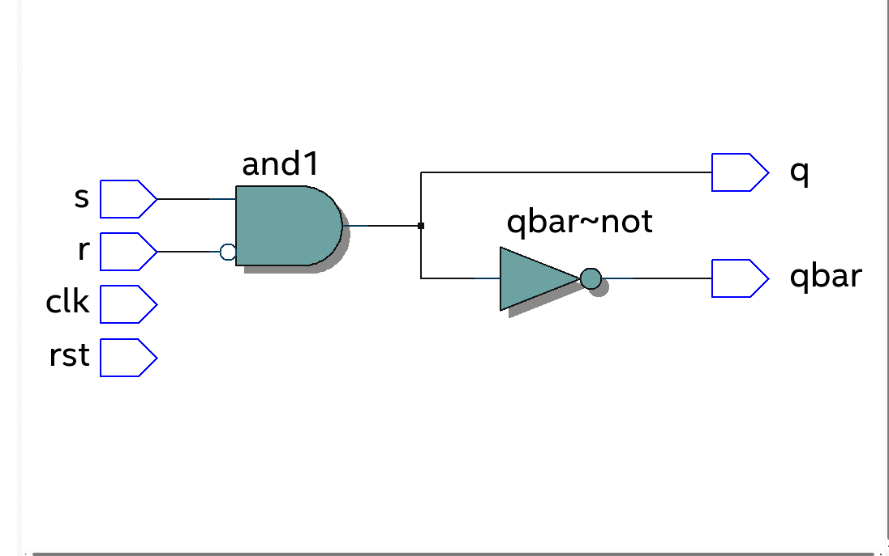
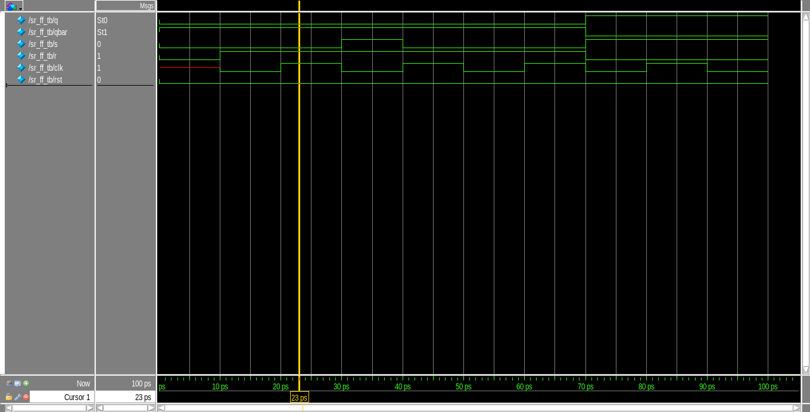
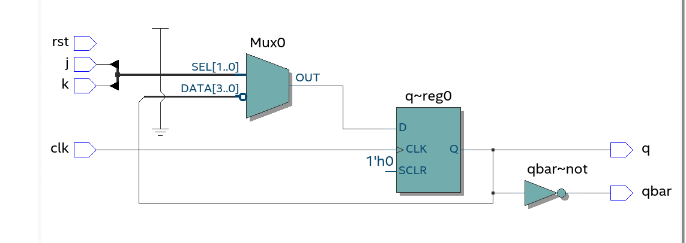
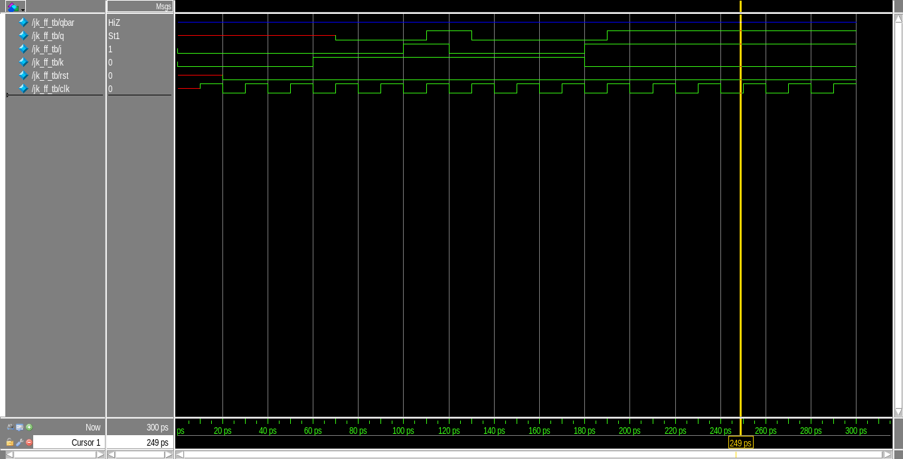

# Projects on Verilog

## 11 May 2021:
1. Write and RTL description and test bench fo a D flipflop.
2. Write structural model for T flipflop using D flipflop

> ## D Flipflop

- It has a single input which gives "q" as output. on either positive or negative clock edge.

```
module dflipflop(
	input 	clk, d, rst,
	output	reg q,
	output 	q_bar
);

	always @(posedge clk) begin
		if (rst)
			begin 
			q <= 0;
			end
		else
			begin
			q <= d;
			end
	end
	
	assign q_bar = ~q;

endmodule
```

- Testbench for D Flipflop

```
module dflipflop_tb();
    reg     clk, d, rst,
    wire  q, q_bar

    dflipflop DFF(
        .clk(clk), 
        .d(d), 
        .rst(rst),
        .q(q),
        .q_bar(q_bar)
     ); 

    always begin
       #(T/2) clk = 1'b0;
       #(T/2) clk = ~clk;
    end

    task initialization;
        begin
            {d, rst} = 0;
        end
    endtask

    // rst is in negedge to solve hold time and setup time violations
    // Synchronous reset
    task rst_in;
        begin
            @(negedge clk)
            rst = 1'b1;
            @(negedge clk)
            rst = 1'b0;
        end
    endtask

    task d_input;
        begin
            @(negedge clk)
            d = i;
        end
    endtask

    initial begin
        initialization;
        rst_in;
        d_input(1'b1);
        d_input(1'b0);
        d_input(1'b0);
        d_input(1'b1);
        d_input(1'b0);
        d_input(1'b1);
        d_input(1'b1);
        d_input(1'b1);

        #500 $finish;
    end

endmodule
```
> ## T Flipflop

```
module tff(
    input   t, rst, clk,
    output  q, q_bar
);

    wire w;

    xor(t, w, q);
    dflipflop DFF(.d(t), .clk(clk), .rst(rst), .q(q), .q_bar(q_bar));

endmodule
```

## 12 May 2021

1) Write an RTL description for JK flip flop using parameter declaration for the respecticve scenarious HOLD, SET, RESERT, TOGGLE.
2) Implement SR latch in gate level modelling and verify using testbench
3) Write an RTL and testbench for 4 bit SISO

```
reg [3:0] next_state;
reg [1:0] a=2'b11;
initial begin
    casex(a)
        2'b1x   : next_state = 3;
        2'bx1   : next_state = 2;
        default : next_state = 0;
    endcase
end
```

> ## RTL for SR Latch using Gate Level



- A SR latch has two input SET(s) and RESET(r) which gives the output "q" on a posedge or negedge of a clock.

```
module sr_latch_gate(
    input   s, r, clk, rst,
    output  q, qbar
);

    wire w0;
    
    not not1(w0, r);
    and and1(q, s, w0);
    not not2(qbar, q);

endmodule
```
- Testbench for SR flipflop.
```
module sr_ff_tb();

    wire q, qbar;
    reg s, r, clk, rst;

    sr_latch_gate SR1(
        .s(s), .r(r),
        .clk(clk), .rst(rst),
        .q(q), .qbar(qbar)
    );
    
    always begin
        #10 clk = 1'b0;
        #10 clk = 1'b1;
    end

    task initialize;
    begin
        s   = 1'b0;
        r   = 1'b0;
        rst = 2'b00;
    end
    endtask

    task sr_input;
    begin
        {s,r} = {$random} % 4;
       #10;
    end
    endtask

    initial begin
        initialize;
        repeat(8)
        begin
            sr_input;
        end
    end

    initial begin
        $monitor("Inputs: s=%d, r=%d, Outputs: q=%d, qbar=%d", s,r,q,qbar);
        #100 $finish;
    end
endmodule 
```
- SR Flip flop timing wave



- SR testbench output values
```
# Inputs: s=0, r=0, Outputs: q=0, qbar=1
# Inputs: s=0, r=1, Outputs: q=0, qbar=1
# Inputs: s=1, r=1, Outputs: q=0, qbar=1
# Inputs: s=0, r=1, Outputs: q=0, qbar=1
# Inputs: s=1, r=0, Outputs: q=1, qbar=0
# ** Note: $finish    :
```

> ## RTL for JK flipflop using parameter declaration



- JK Flipflop has two inputs set and reset which gives the output q on positive or negative clock edge.

```
// Parameter declaration

always@ (posedge clk)
    begin 
        if (rst)
            q<= 0;
        else
            begin
                case ({j,k})
                HOLD    : q<=q;
                RESET   : q<=0;
                SET     : q<=1; 
                TOGGLE  : q<=~q;
                default : q<=1'bz;
                endcase
            end
    end

assign q_bar = ~q;
```

**JK flip flop testbench**
```
module jkff_tb()
    task jk_input;
        begin
            @(negedge clk)
            {j,k} = {$random}%4;
            #20;
        end
    endtask
    // alternate method for jk inputs
    task jk_input(input m,n);
        begin
            @(negedge clk)
            j = m;
            k = n;
        end
    endtask

    initial begin
        initialization;
        rst_input;
        jk_input(1'b1, 1'b0);
        jk_input;
        jk_input;
        jk_input;
        jk_input;
        jk_input;
    end
endmodule
```
- JK flipflop timing wave



*** 

