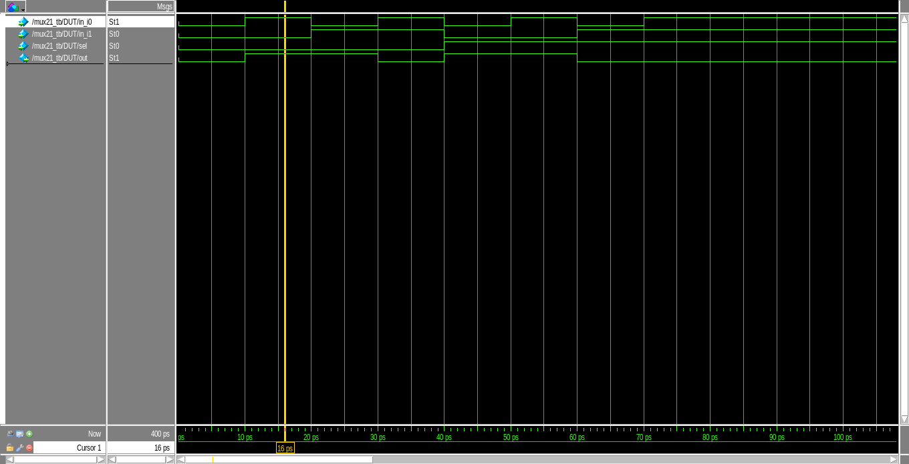

# Lab 1 Examples

## Half Adder
- RTL for half adder
- Inputs: a, b
- Outputs: sum, carry
```
module half_adder(input a,b,
	          output sum,carry);
				 
   //Understand the Data-flow abstraction
   assign sum   = a ^ b;
   assign carry = a & b;

endmodule
```

# Full Adder

- RTL for full adder implemented using half addders.
- Inputs: 

```
module full_adder(a_in,
    b_in,
    c_in,
    sum_out,
    carry_out);

    input   a_in, b_in, c_in;
    output  sum_out, carry_out;

    wire    w1, w2, w3;

    half_adder HA1(.a(a_in), .b(b_in), 
        .sum(w1), .carry(w2));
    half_adder HA2(.a(w1), .b(c_in), 
        .sum(sum_out), .carry(w3));

    or or1(carry_out, w2, w3);

endmodule
```

- Testbench for full adder

```
module full_adder_tb();

    reg   a,b,cin;
    wire  sum,carry;

    integer i;

    full_adder DUT( a,
        b,
        c_in,
        sum,
        carry);

    initial begin
        a   = 1'b0;
        b   = 1'b0;
        cin = 1'b0;
    end

    initial begin 
        for (i=0;i<8;i=i+1)
        begin
            {a,b,cin}=i;
            #10;
        end
    end

    initial begin
        $monitor("Input a=%b, b=%b, c=%b, Output sum =%b, carry=%b",a,b,cin,sum,carry);
        
        #100 $finish;
    end

endmodule
```

## 2:1 Multiplexer 
- Inputs:   in_i0, in_i1, sel
- Outputs:  out

```
module mux21(input in_i0, in_i1, sel,
            output out);

    assign out = (~sel * in_i0) + (sel + in_i1);

endmodule
```


- Testbench for 2:1 multiplexer

```
module mux21_tb();
 
    reg in_i0, in_i1, sel;
    wire out;

    integer i ;

    mux21 DUT(in_i0, in_i1, sel, out);

    initial begin
        in_i0 = 1'b0;
        in_i1 = 1'b0;
        sel = 1'b0;
    end

    initial begin
       for (i = 0; i<8; i=i+1)
            begin
                {sel, in_i1, in_i0}=i;
                #10;
            end
	
    end
 
    initial begin
        $monitor("Input i0 = %b, i1 = %b, Select = %b, Output = %b", in_i0, in_i1, sel, out);
        
        #100 $finish;
    end

endmodule
```

## Ripple Carry Adder


- RTL for ripple carry adder

```
`module ripple_carry_adder (input [3:0] a, b,
							output [3:0] sum_o, 
							output carry_o,
							input c_in);
	wire w0,w1,w2;

	full_adder FA1(.a_in(a[0]), .b_in(b[0]), 
        .c_in(c_in), .sum_out(sum_o[0]), .carry_out(w0));
	full_adder FA2(.a_in(a[1]), .b_in(b[1]), 
        .c_in(w0), .sum_out(sum_o[1]), .carry_out(w1));
	full_adder FA3(.a_in(a[2]), .b_in(b[2]), 
        .c_in(w1), .sum_out(sum_o[2]), .carry_out(w2));
	full_adder FA4(.a_in(a[3]), .b_in(b[3]), 
        .c_in(w2), .sum_out(sum_o[3]), .carry_out(carry_o));

endmodule
```

- Testbench for Ripple carry adder

```
module ripple_carry_adder_tb();

   reg   [3:0] a, b;
   reg   c_in;
   wire  [3:0] sum, carry_o;

   integer i;

	ripple_carry_adder DUT( a, b, sum, carry_o, c_in);

   initial begin
        a = 4'b0000;
        b = 4'b0000;
        c_in = 1'b0;
    end

    initial begin 
    for (c_in=0; c_in<2; c_in = c_in+1)
        for (i=0;i<16;i=i+1)
            begin
                a = i;
                b = i;
                #10;
            end
    end
				
    initial begin
        $monitor("Input a=%b, b=%b, Output sum =%b, carry=%b",a,b, sum,carry_o);

        #100 $finish;
    end
   
endmodule

```