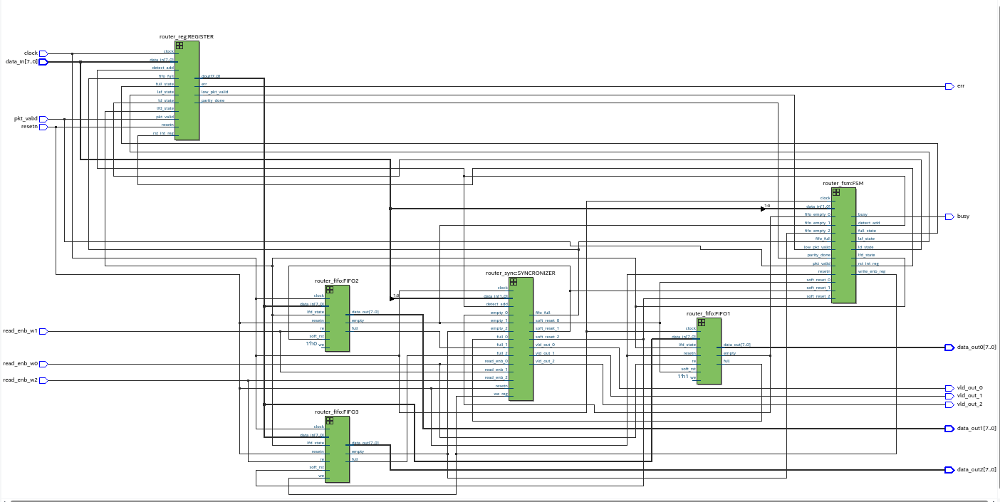

## First IN First OUT

**Description**

- In this FIFO is of length 9-bits width and 16 locations of depth.
- The FIFO works on the system clock and is reset from synchronous active LOW reset.
- The FIFO has a memory size of 16x9. The extra bit in the data width is appended to detect the header byte.

### Port listing of FIFO:

| Port      | Type    | Description
| ---       | ---     | ---
| clock     | input   | clock signal
| resetn    | input   | active-low reset pin
| we        | input   | write enable pin
| re        | input   | read enable pin
| soft_rst  | input   | soft reset 
| lfd_state | input   | active high on load first data 
| data_in   | input   | 8-bit input data
| full      | output  | High when data is written into FIFO register
| empty     | output  | High when FIFO register is empty
| data_out  | output  | 8-bit output data
: List of ports for Router FIFO

### Block Diagram for FIFO

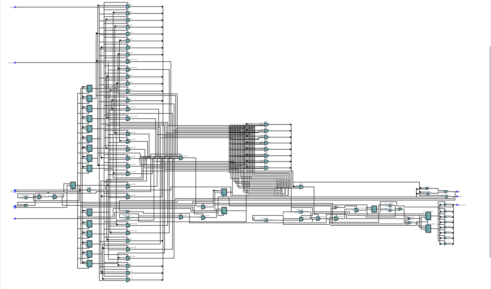

### Timing Analysis for FIFO

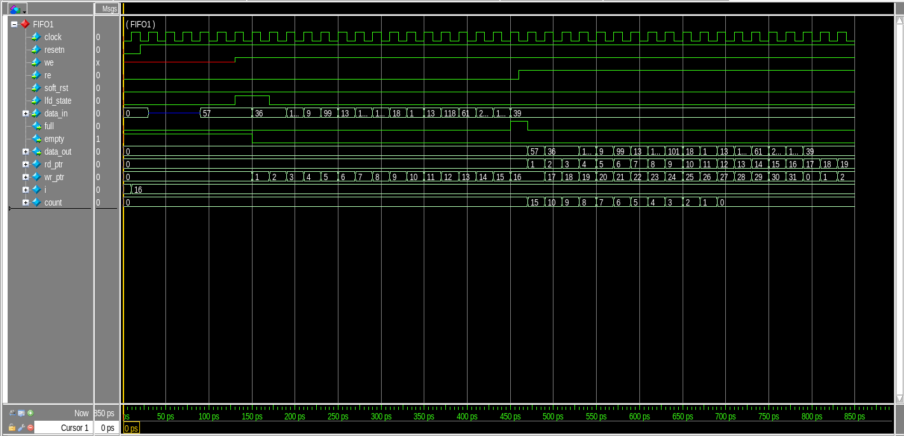

--- 

## Router Synchronizer

**Ports for Synchronizer:**

| Port            | Type      | Description |
|:--             |:-:        |:------------|
| detect_add      | input     | used to select FIFO till a packet routing is over for the selected FIFO.    |
| data_in         | input     | used to select FIFO till a packet routing is over for the selected FIFO.    |
| we_reg          | input     | generate output write enable signal for the FIFO    |
| clock           | input     | clock signal for the synchronizer   |
| resetn          | output    | internal reset signal for the synchronizer  |
| vld_out_0       | output    | HIGH when ~empty_0  |
| vld_out_1       | output    | HIGH when ~empty_1  |
| vld_out_2       | input     | HIGH when ~empty_2  |
| re_0            | input     | read enable signal for FIFO_0   |
| re_1            | input     | read enable signal for FIFO_1   |
| re_2            | input     | read enable signal for FIFO_2   |
| empty_0         | input     | empty indicator for FIFO 0  |
| empty_1         | input     | empty indicator for FIFO 1  |
| empty_2         | input     | empty indicator for FIFO 2  |
| full_0          | output    | full signal indication for FIFO_0   |
| full_1          | output    | full signal indication for FIFO_1   |
| full_2          | output    | full signal indication for FIFO_2   |
| fifo_full       | output    | equals to full_0 when data_in = 2'b00, full_1 when data_in = 2'b01, full_2 when data_in = 2'b10 else fifo_full =0.  |
| soft_reset_0    | input     | for FIFO 0. HIGH if re_0 is not asserted in 30 clock cycles of vld_out_0 being asserted.    |
| soft_reset_1    | input     | for FIFO 1. HIGH if re_2 is not asserted in 30 clock cycles of vld_out_1 being asserted.    |
| soft_reset_2    | input     | for FIFO 2. HIGH if re_2 is not asserted in 30 clock cycles of vld_out_2 being asserted.    |
| write_enb       | output    | write enable signal for writing into FIFO   |
: List of ports for the Router Synchronizer

**Description:**

This module provides synchronization between router FSM and router FIFO modules. It provides faithful communication between the single input port and three output ports.

### Block Diagram Synchronizer

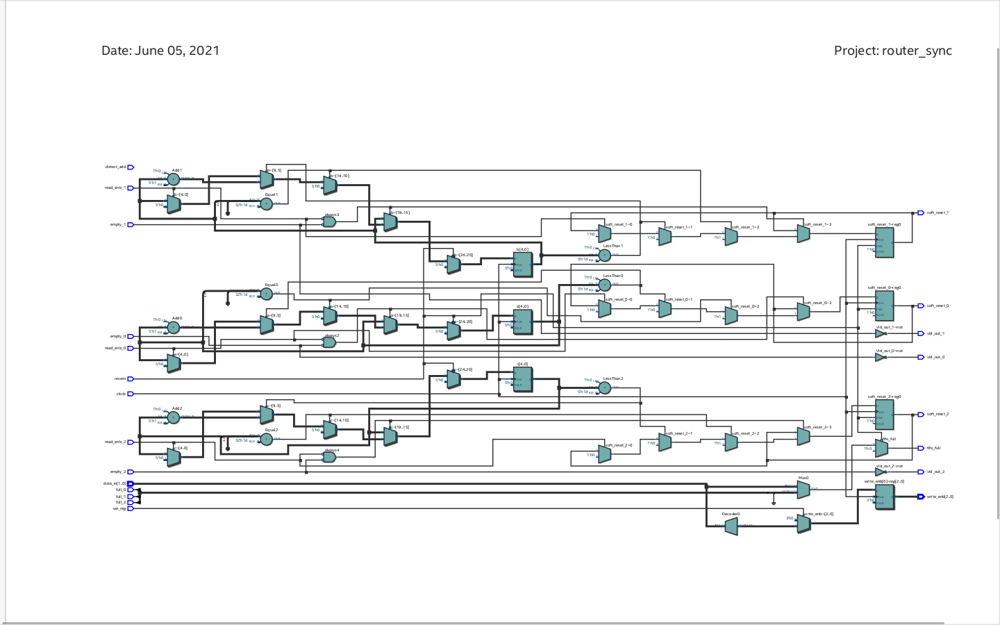

### Timing Analysis for Synchronizer

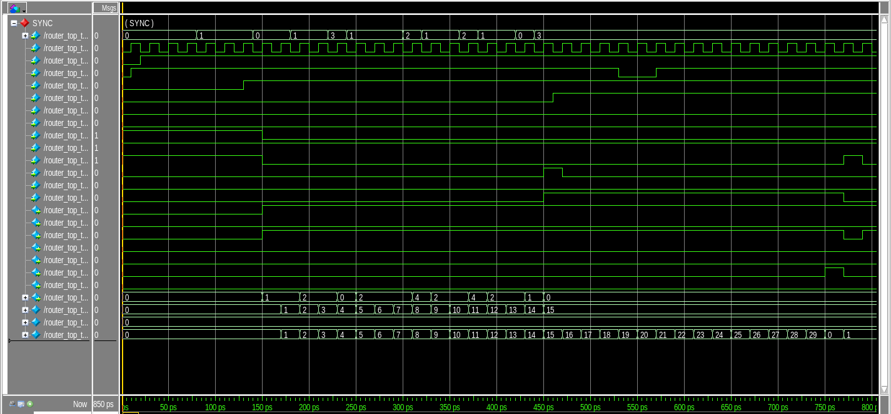

## Finite State Machine (FSM)

**Description:**

The FSM module is the controller circuit for the ROUTER. This module generates all the control signals when a new packet is received in order to transfer the packet to the output port.

**Port Listing for Router FSM:**

| Port              | Type      |
| ------------------|:---------:|
| data_in           | input     |
| clock             | input     |
| resetn            | input     |
| pkt_valid         | input     |
| parity_done       | input     |
| fifo_full         | input     |
| soft_reset_0      | input     |
| soft_reset_1      | input     |
| soft_reset_2      | input     |
| low_pkt_valid     | input     |
| fifo_empty_0      | input     |
| fifo_empty_1      | input     |
| fifo_empty_2      | input     |
| reg busy          | output    |
| write_enb_reg     | output    |
| reg detect_add    | output    |
| full_state        | output    |
| lfd_state         | output    |
| ld_state          | output    |
| laf_state         | output    |
| reg rst_int_reg   | output    |
: List of ports for Router FSM

### Block Diagram Router FSM

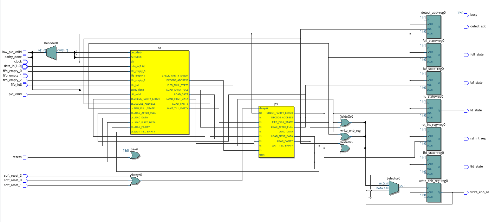 

### Timing Analysis

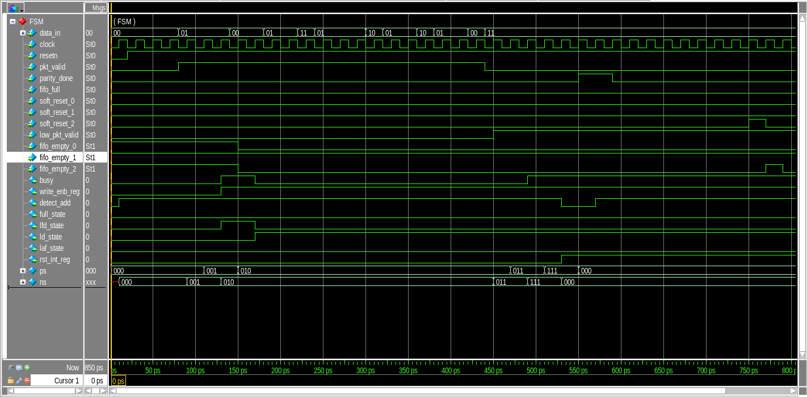

## Register 

**Port Listing for Refister:**

Port          | Type
---           | ---
clock         |input
resetn        |input   
pkt_valid     |input
data_in       |input  
fifo_full     |input
rst_int_re    |input
detect_add    |input
full_state    |input
ld_state      |input
laf_state     |input
lfd_state     |input
parity_done   |output
low_pkt_valid |output
err           |output 
dout          |output 
: List of ports for Router Register

### Block Diagram Register 

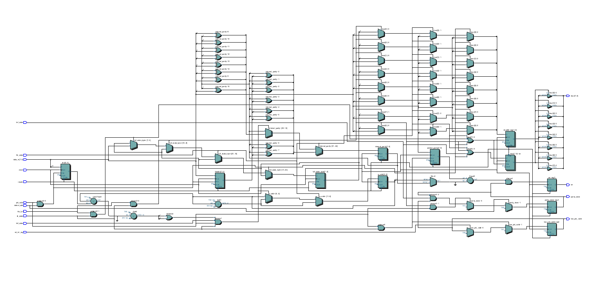

\newpage 

### Timing Analysis for Register 

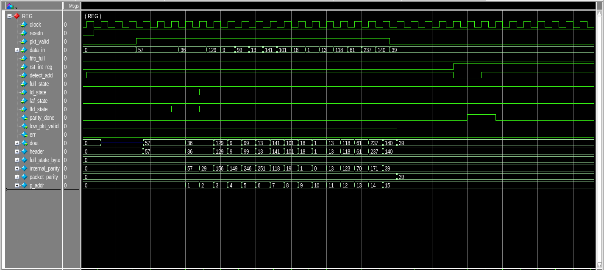

## Router Top 

**Port Listing for Router Top:**

Port      | Type      | Descriopion
---       | ---       | --- 
clock     | input     | Clock signal
resetn    | input     | Active low reset 
pkt_valid | input     | Packet valid signal
data_in   | input     | 8-bit Input data
read_enbw | input     | read enable pin
data_out0 | output    | 8-bit data of FIFO-1 
data_out1 | output    | 8-bit data of FIFO-2
data_out2 | output    | 8-bit data of FIFO-3
busy      | output    | busy signal
err       | output    | error signal
vld_out_0 | output    | valid out for FIFO-1
vld_out_1 | output    | valid out for FIFO-2
vld_out_2 | output    | valid out for FIFO-3
: List of ports for Router Top

### Block Diagram Router Top

#### Output:

**Flow Summary**

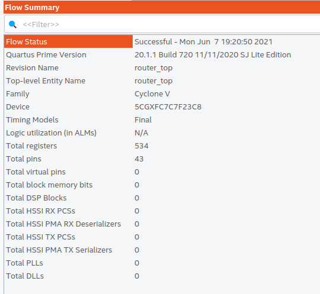

\newpage 

**Analysis & Synthesis Resource Usage Summary:**

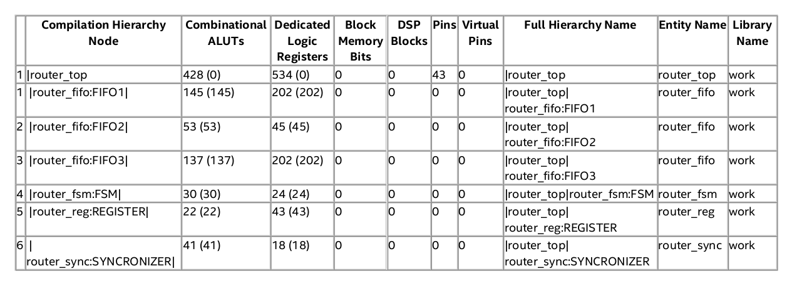

\newpage 

**Post-Synthesis Netlist for Top Partition**

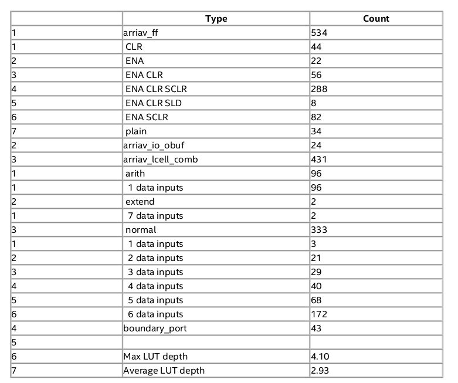

\newpage 

### Timing Analysis for Router Top

- We shall be sending a data of 15 bytes and verify the output from FIFO-1.
- 
**Router Top Timing Analysis**

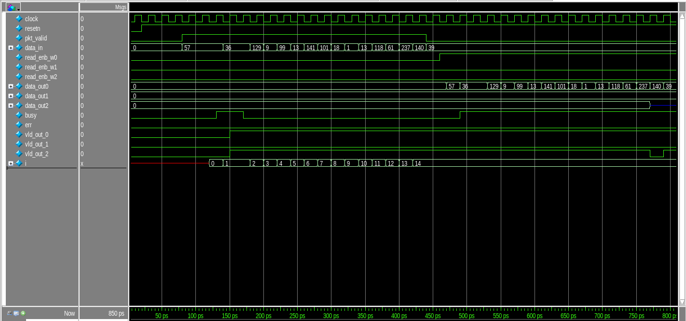

**Router Top DUT**

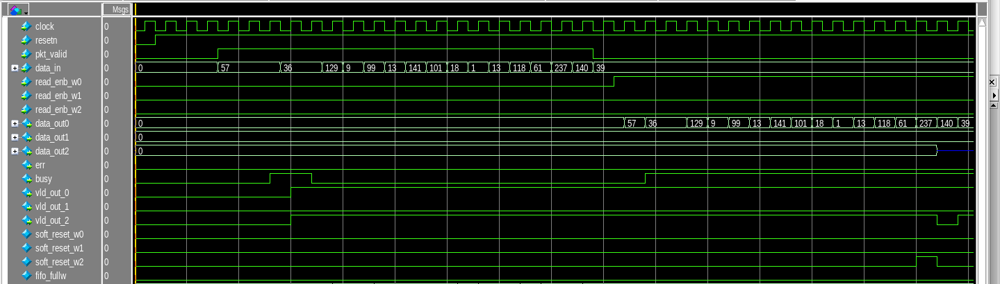

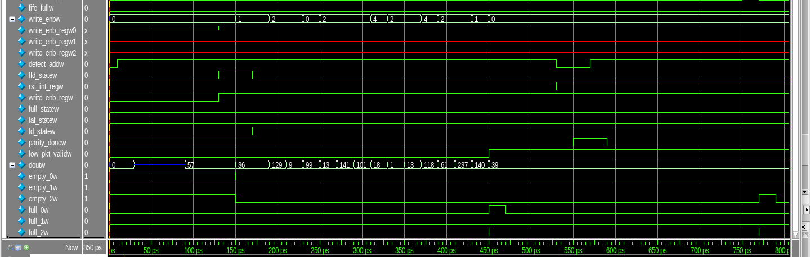

**Conclusion:** The router is simulated and synthesized successfully.